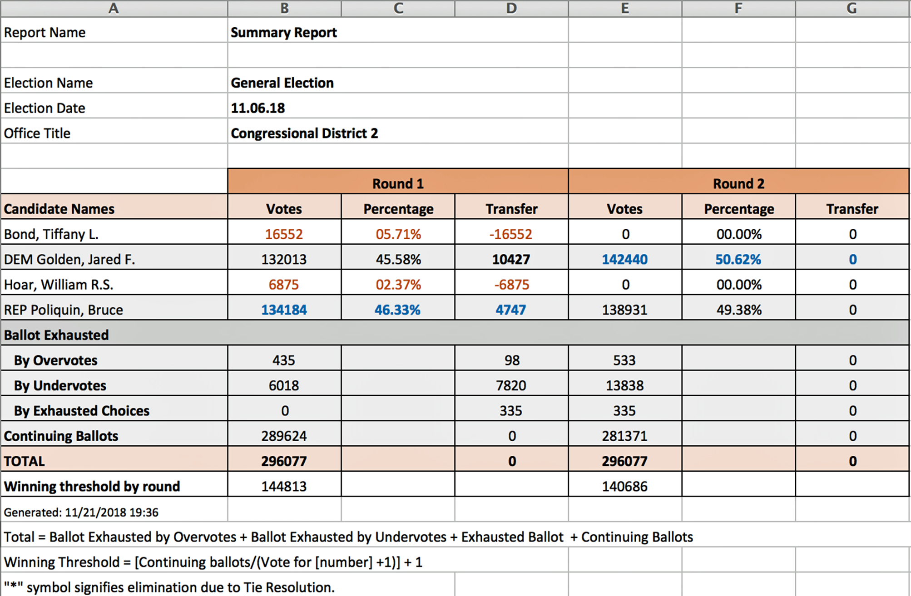

##Ranked-Choice Voting in Maine Congressional District 2: Nov. 6, 2018.
##The data are published on a Maine Secretary of State website.

[Click Here](https://www.maine.gov/sos/cec/elec/results/results18.html#Nov6)"Certified Updated Results"

[Click Here](https://www.maine.gov/sos/cec/elec/upcoming/pdf/250rcvnew.pdf)"Ranked-Choice Rules"

##Load libraries
```{r, echo=FALSE,results='hide'}
suppressMessages(library(readr)) # fast load
suppressMessages(library(dplyr)) # filter
suppressMessages(library(ggplot2))
suppressMessages(library(forcats))
```
```{r, message=FALSE,echo=FALSE,results='hide'}
rm(list = ls())
path <- "https://raw.github.com/damonzon/Ranked_Choice_Voting_Maine/master/MaineTidyData2018.csv"
data <- read_csv(path)
data <- filter (data, first != "overvote")
table(data$first)
round(prop.table(table(data$first)), 4)
```
##Write functions to shift column data to the left
```{r,echo=FALSE}
shift_left <- function(x) {
    shift$first <<- shift$second
    shift$second <<- shift$third
    shift$third <<- shift$fourth
    shift$fourth <<- shift$fifth
    shift$fifth <<- "undervote"
}
```
```{r,echo=FALSE}
shift_under <- function(x) {
    shift_left(shift)
    not_under <<- filter(shift, first != "undervote")
    shift <<- filter(shift, first == "undervote")
    shift_left(shift)
    shift <<- rbind(not_under, shift)
    shift <<- filter(shift, first != "undervote")
}
```
```{r,echo=FALSE,results='hide'}
continue <- filter(data, first != "undervote")
table(continue$first)
shift <- filter(data, first == "undervote")
shift_left(shift)
shift <- filter(shift, first != "undervote" & first != "overvote")
continue <- rbind(continue, shift)
```
#Round 1 Results
```{r,echo=FALSE}
table(continue$first)
round(prop.table(table(continue$first)), 4)
```
## The vote totals are identical to those in the updated certified report.
##Poliquin with 134184 votes, led in Round 1 with 46.3%. According to the rules of ranked-choice voting, to be declared a winner, a candidate had to have at least as many votes as the winning threshold.
```{r,echo=FALSE}
Poliquin <- nrow(filter(continue, first == "Poliquin"))
WT <- nrow(continue) * 0.5 + 1
cat("The winning threshold was", WT, "continuing votes")
cat("Poliquin fell short of winning by", WT - Poliquin, "votes")
congress<- as.factor(continue$first)
p <- ggplot(continue, aes(fct_infreq(congress))) +
    geom_bar(fill="red", color="black") +
    theme_bw() +
    ggtitle("Continuing Votes at Round 1\nBlue line at 144813 votes = Minimum Thrreshold to win") +
    xlab("Candidates") +
    ylab("Votes") +
    geom_hline(yintercept = 144813, linetype = "solid", color = "blue", size=1) +
    ylim(0, 150000) +
    coord_flip()
p
```

##We now proceed to the next round by dropping the candidate with the fewest votes: Hoar.
```{r,echo=FALSE,results='hide'}
shift <- filter(continue, first == "Hoar")
shift_under(shift)
shift <- filter(shift, first != "undervote")
right1 <- shift
table(right1$first)
shift <- filter(right1, first == "Hoar")
shift_under(shift)
shift <- filter(shift, first != "undervote")
right2 <- shift
table(right2$first)
shift <- filter(right2, first == "Hoar")
shift_under(shift)
shift <- filter(shift, first != "undervote")
right3 <- shift
table(right3$first)
shift <- filter(right3, first == "Hoar")
shift_under(shift)
shift <- filter(shift, first != "undervote")
right4 <- shift
table(right4$first)
continue <- rbind(continue, right1, right2,
    right3, right4)
continue <- filter(continue, 
    first != "Hoar")
continue <- filter(continue,
    first != "overvote")
```
#Results after dropping Hoar
```{r,echo=FALSE}
table(continue$first)
round(prop.table(table(continue$first)), 4)
```
## All three remaining candidates gained votes from the alternative choices of the Hoar voters. Now Poliquin led with 47.0 to 46.3 for Golden, but the tally was still less than 50% +1.

```{r,echo=FALSE}
Poliquin <- nrow(filter(continue, first == "Poliquin"))
WT <- nrow(continue) * 0.5 + 1
cat("The winning threshold was", WT, "continuing votes")
cat("Poliquin fell short of winning by", WT - Poliquin, "votes")
congress<- as.factor(continue$first)
p <- ggplot(continue, aes(fct_infreq(congress))) +
    geom_bar(fill="red", color="black") +
    theme_bw() +
    ggtitle("Continuing votes after dropping Hoar\nBlue line at 143732 votes = Minimum Thrreshold to win") +
    xlab("Candidates") +
    ylab("Votes") +
    geom_hline(yintercept = 143732, linetype = "solid", color = "blue", size=1) +
    ylim(0, 150000) +
    coord_flip()
p
```

## So we now remove Bond votes and continue the analysis.
```{r,echo=FALSE,results='hide'}
data <- continue
continue <- filter(data, first != "Bond")
shift <- filter(data, first == "Bond" | first == "Hoar")
shift_under(shift)
right1 <- filter(shift, first != "overvote")
shift <- filter(right1, first == "Bond" | first == "Hoar")
shift_under(shift)
right2 <- filter(shift, first != "overvote")
shift <- filter(right2, first == "Bond" | first == "Hoar")
shift_under(shift)
right3 <- filter(shift, first != "overvote")
shift <- filter(right3, first == "Bond" | first == "Hoar")
shift_under(shift)
right4 <- filter(shift, first != "overvote")
continue <- rbind(continue, right1, right2, right3, right4)
continue <- filter(continue, first != "Bond" & first != "Hoar")
```
```{r,echo=FALSE}
table(continue$first)
round(prop.table(table(continue$first)), 4)
```
#Final Results
##The ranked-choice process has produced a clear winner. Golden now has 142440 (50.62%) of the continuing votes, compared to 138931 (49.38%) for Poliquin.
```{r,echo=FALSE}
Golden<- nrow(filter(continue, first == "Golden"))
WT <- round(nrow(continue) * 0.5 + 1)
cat("The winning threshold was", WT, "continuing votes")
cat("Golden exceeded the minimun threshold by",Golden - WT, "votes")
```
```{r,echo=FALSE}
win <- factor(c("lightblue","red"))
congress<- as.factor(continue$first)
p <- ggplot(continue, aes(fct_infreq(congress))) +
    geom_bar(fill= win, color="black") +
    theme_bw() +
    ggtitle("Vote tally at Final Round\nBlue line at 140686 votes = Minimum Thrreshold.\nThe winner,Jared Golden got 1754 more votes than needed.") +
    xlab("Candidates") +
    ylab("Votes") +
    geom_hline(yintercept = 140686, linetype = "solid", color = "blue", size=1) +
    ylim(0, 150000) +
    coord_flip()
p
```

###Some have questioned the validity of the election results, because the software used by the Secretary of State was "propriety". In other words, we don't know what it is and what algorithms it used. Thus it was important to demonstrate that "open" software, available to all, can get the identical results, and give voters confidence that the process is fair, accurate and transparent.

###The gold standard for data analysis in science, elections, etc. is "Reproducibility". This analysis was done with the programming language "R", using Rmarkdown to produce this pdf file. It could also be output to Word and html formats.

###Here are the same results obtained by the "Python" programming language.

[Click Here](https://github.com/ntefft/rcv/blob/master/maine%20congressional%20district%202%20rcv%20replication.ipynb)"Maine Congressional District 2: Replication"


